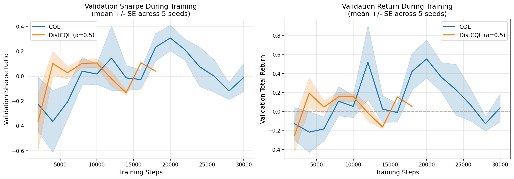
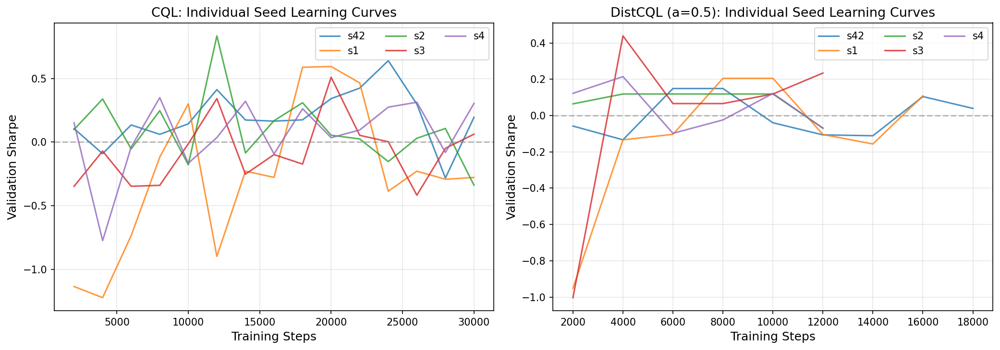
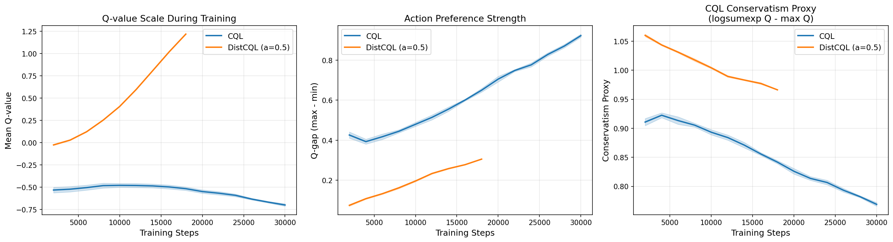
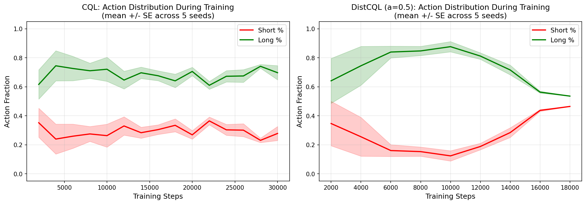

# Hyperparameter Table & Learning Curves

**Date:** 2026-04-13
**Purpose:** Complete experimental documentation following Henderson et al. (2018) best practices.

---

## 1. Hyperparameter Comparison

| Hyperparameter | CQL | DistCQL (a=0.5) | DQN (Double DQN) |
|---------------|-----|-----------------|-------------------|
| **Algorithm** | Discrete CQL (d3rlpy) | Quantile-Regression CQL (custom PyTorch) | Double DQN (d3rlpy) |
| **CQL alpha** | 1.0 | 0.5 | N/A (no conservatism) |
| **Alpha tail** | N/A | 0.25 | N/A |
| **Hidden layers** | [256, 256] | [256, 256] | [128, 128] |
| **Activation** | ReLU | ReLU | ReLU |
| **Layer norm** | Yes | Yes | Yes |
| **Dropout** | 0.1 | 0.1 | 0.1 |
| **N critics / ensemble** | 3 | 3 | 3 |
| **Learning rate** | 1e-4 | 1e-4 | 3e-4 |
| **Weight decay** | 1e-4 | 1e-4 | 1e-4 |
| **Gradient clipping** | 1.0 | 1.0 | 1.0 |
| **Batch size** | 256 | 256 | 256 |
| **Discount (gamma)** | 0.95 | 0.95 | 0.95 |
| **Target update interval** | 2,000 steps | 2,000 steps | 1,000 steps |
| **Total training steps** | 30,000 | 30,000 | 20,000 |
| **Steps per epoch** | 2,000 | 2,000 | 2,000 |
| **Early stopping patience** | 4 epochs | 4 epochs | 4 epochs |
| **Early stopping metric** | Val Sharpe | Val Sharpe | Val Sharpe |
| **N quantiles** | N/A | 51 (tail-focused) | N/A |
| **Quantile spacing** | N/A | Tail-focused (denser at tails) | N/A |
| **Huber loss kappa** | N/A | 1.0 | N/A |
| **Action selection** | Greedy (argmax Q) | Pessimistic mean (min-of-ensemble) | Greedy (argmax Q) |
| **Action space** | Discrete {short, flat, long} | Discrete {short, flat, long} | Discrete {short, flat, long} |

### Data Configuration

| Parameter | Value |
|-----------|-------|
| **Asset** | BTC/USD daily |
| **Train period** | 2017-01-01 to 2021-12-31 |
| **Validation period** | 2022-01-01 to 2023-12-31 (bear market) |
| **Test period** | 2024-01-01 to 2025-12-31 (bull market) |
| **Train transitions** | ~1,800 daily |
| **Observation features** | Technical indicators + position state |
| **Reward** | Position-weighted log-return with drawdown penalty |
| **Position levels** | {-1.0, 0.0, +1.0} (short, flat, long) |

---

## 2. Learning Curves

### 2.1 Validation Performance During Training

**Left:** Validation Sharpe ratio averaged across 5 seeds, with standard error bands. CQL (blue) achieves higher and more stable Sharpe values throughout training. DistCQL (orange) shows higher variance across seeds.

**Right:** Validation total return. CQL converges to positive returns more consistently, while DistCQL's wide confidence bands reflect the seed sensitivity documented in the seed robustness analysis.

### 2.2 Individual Seed Learning Curves

**Left:** CQL's 5 seeds show qualitatively similar trajectories despite different final values. Most seeds trend upward after initial instability.

**Right:** DistCQL's seeds diverge much more dramatically. Some seeds (s42, s1) find good solutions while others (s3, s4) converge to suboptimal strategies early and plateau. This confirms that DistCQL's loss landscape has multiple local optima that different initializations can fall into.

### 2.3 Q-Value Diagnostics

**Left (Q-value scale):** CQL's Q-values trend downward over training due to the conservative penalty, while DistCQL's remain more stable. The divergence shows CQL's conservatism penalty is actively suppressing overestimation.

**Middle (Action preference strength):** The Q-gap (max Q - min Q) increases over training for both models, indicating they are learning to differentiate between actions. CQL develops stronger preferences.

**Right (Conservatism proxy):** The logsumexp(Q) - max(Q) term directly measures CQL's regularization effect. CQL's conservatism proxy is consistently higher, confirming its stronger anchoring to the behavior policy.

### 2.4 Action Distribution During Training

**Left (CQL):** CQL maintains a relatively stable action distribution throughout training: ~60-70% long, ~25-35% short. The consistency across seeds (narrow bands) explains CQL's robustness.

**Right (DistCQL):** DistCQL starts with high long fraction but shows diverging behavior — some seeds shift heavily toward shorting while others stay long. The wide confidence bands on the short fraction (red) directly visualize the seed sensitivity: different initializations lead to fundamentally different trading strategies.

---

## 3. Key Observations from Learning Curves

1. **CQL trains more stably than DistCQL.** CQL's validation Sharpe has narrower confidence bands and more consistent upward trends across seeds.

2. **DistCQL's seed sensitivity is visible in the action distributions.** The wide red band in DistCQL's short fraction shows that different seeds learn dramatically different shorting behaviors — from 0% to 70%+ short.

3. **Early stopping interacts with seed quality.** DistCQL seeds that converge to bad strategies (excessive shorting) often do so in the first 2-4 epochs, before early stopping can intervene. The early stopping metric (val Sharpe) can be positive even for overfit strategies that memorize bear-market patterns.

4. **CQL's conservatism penalty provides training stability.** The Q-value diagnostics show that CQL's penalty actively prevents Q-value inflation, which translates to more consistent action distributions and less sensitivity to initialization.
